# 전자상거래 시스템 백엔드

이 프로젝트는 Spring Boot로 구축된 간단한 전자상거래 시스템의 백엔드입니다.

## 프로젝트 구조

이 프로젝트는 계층형 아키텍처를 따르며, 기능별로 다음과 같은 패키지로 구성되어 있습니다:

-   `src/main/java/com/e_commerce_system/backend/`
    -   `controller`: 들어오는 HTTP 요청을 처리하고, 입력을 검증하며, 적절한 서비스 메서드를 호출합니다. API의 진입점입니다.
        -   `OrderController.java`: 주문 생성을 관리합니다.
        -   `ProductController.java`: 상품 조회를 관리합니다.
    -   `service`: 애플리케이션의 핵심 비즈니스 로직을 포함합니다. 리포지토리 및 기타 서비스 호출을 조율합니다.
        -   `OrderService.java`: 주문 생성 및 재고 관리를 위한 비즈니스 로직입니다.
        -   `ProductService.java`: 상품 정보 조회를 위한 비즈니스 로직입니다.
    -   `repository`: 이 계층은 데이터 접근을 담당합니다. 이 인터페이스들은 Spring Data JPA의 `JpaRepository`를 확장하여 기본적인 데이터베이스 연산(CRUD - 생성, 조회, 수정, 삭제)을 즉시 사용할 수 있도록 합니다. 이 계층은 **DAO(Data Access Object)** 역할을 합니다.
        -   `MemberRepository.java`: `Member` 엔티티에 대한 데이터 접근을 담당합니다.
        -   `OrderRepository.java`: `Order` 엔티티에 대한 데이터 접근을 담당합니다.
        -   `ProductRepository.java`: `Product` 엔티티에 대한 데이터 접근을 담당합니다.
    -   `domain`: 데이터베이스 테이블에 매핑되는 순수 자바 객체인 JPA 엔티티 클래스를 포함합니다.
        -   `Member.java`: 사용자를 나타냅니다.
        -   `Order.java`: 고객 주문을 나타냅니다.
        -   `Product.java`: 판매용 상품을 나타냅니다.
    -   `dto` (Data Transfer Object): 클라이언트와 서버 간의 데이터 전송에 사용되는 객체입니다.
        -   `OrderRequest.java`: 새 주문을 생성하는 데 필요한 데이터를 전달합니다.

## UML 클래스 다이어그램

아래 다이어그램은 이 프로젝트의 주요 클래스와 그 관계를 시각적으로 보여줍니다. 각 패키지(controller, service, repository, domain, dto)의 클래스들이 어떻게 서로 의존하고 상호작용하는지 나타냅니다.



## k6를 이용한 부하 테스트

이 프로젝트는 부하 테스트를 위해 [k6](https://k6.io/)를 사용합니다.

### 사전 요구 사항

- 사용자의 컴퓨터에 [k6](https://k6.io/docs/getting-started/installation/)가 설치되어 있어야 합니다.

### 테스트 실행

1.  백엔드 애플리케이션이 실행 중인지 확인합니다.
2.  터미널을 열고 `k6` 디렉터리로 이동합니다.
3.  다음 명령어를 실행합니다:

    ```bash
    .\run_k6_test.bat
    ```

    또는 k6 스크립트를 직접 실행할 수도 있습니다:

    ```bash
    k6 run scripts/test.js
    ```