# Controller 계층

이 패키지는 클라이언트의 HTTP 요청을 받아 서비스 계층으로 전달하는 역할을 합니다. API의 엔드포인트(end-point)를 정의하고, 요청 데이터를 검증하며, 최종적으로 처리된 결과를 클라이언트에게 응답합니다.

### 핵심 코드 설명

- **`@RestController`**: 이 클래스가 RESTful 웹 서비스의 컨트롤러임을 나타냅니다. 각 메소드의 반환 값은 자동으로 JSON 형태로 변환됩니다.
- **`@RequestMapping("/api/...")`**: 컨트롤러가 처리할 공통적인 URL 경로를 지정합니다.
- **`ProductController.java`**: `/api/products` 경로의 요청을 처리합니다.
    - **`@GetMapping`**: 상품 전체 목록을 조회하는 GET 요청을 처리합니다.
    - **`@GetMapping("/{id}")`**: 특정 ID를 가진 상품 하나를 조회하는 GET 요청을 처리합니다.
- **`OrderController.java`**: `/api/orders` 경로의 요청을 처리합니다.
    - **`@PostMapping`**: 새로운 주문을 생성하는 POST 요청을 처리합니다.
    - **`@RequestBody`**: 클라이언트가 보낸 JSON 형식의 본문(body) 데이터를 `OrderRequest` DTO 객체로 변환해줍니다.

### 시각화 (Mermaid)

