# Domain 계층

이 패키지는 애플리케이션의 핵심 데이터 모델인 엔티티(Entity) 클래스들을 포함합니다. 각 클래스는 데이터베이스의 테이블과 직접적으로 매핑(mapping)되며, 시스템이 다루는 데이터의 구조를 정의합니다.

### 핵심 코드 설명

- **`@Entity`**: 이 클래스가 JPA 엔티티임을 나타냅니다. 데이터베이스의 테이블과 일대일로 매핑됩니다.
- **`@Id`**: 엔티티의 기본 키(Primary Key)가 되는 필드를 지정합니다.
- **`@GeneratedValue(strategy = GenerationType.IDENTITY)`**: 기본 키 값이 데이터베이스에 의해 자동으로 생성되도록 합니다. (예: Auto-increment)
- **`Product.java`**: 상품 정보를 나타내는 핵심 엔티티입니다.
- **`Member.java`**: 사용자 정보를 나타내는 엔티티입니다.
- **`Order.java`**: 주문 정보를 나타내는 엔티티입니다.
    - **`@ManyToOne`**: 다른 엔티티와의 관계를 나타냅니다. 예를 들어, 하나의 `Member`는 여러 개의 `Order`를 가질 수 있으므로 `Order` 입장에서는 `Member`와 다대일(N:1) 관계가 됩니다.

### 시각화 (Mermaid)

