# DTO (Data Transfer Object) 계층

이 패키지는 계층 간 데이터 전송을 위해 사용되는 객체인 DTO(Data Transfer Object)를 포함합니다. DTO는 클라이언트의 요청 데이터를 서버에서 받거나, 서버의 데이터를 클라이언트에게 보낼 때 사용되는 데이터 전용 컨테이너입니다.

DTO를 사용하면 내부 로직이나 데이터베이스 구조(Domain)를 외부에 직접 노출하지 않고, API 명세에 맞는 데이터만을 주고받을 수 있습니다.

### 핵심 코드 설명

- **`OrderRequest.java`**: 클라이언트가 새로운 주문을 생성할 때 보내는 요청 데이터를 담는 DTO입니다.
    - `memberId`, `productId`, `quantity` 필드를 통해 주문에 필요한 최소한의 정보만을 전달받습니다.
    - `@Getter`, `@Setter` 어노테이션을 통해 각 필드의 값을 읽거나 설정할 수 있습니다.

### 시각화 (Mermaid)

