# Service 계층

이 패키지는 애플리케이션의 핵심 비즈니스 로직을 담당합니다. 컨트롤러로부터 전달받은 데이터를 바탕으로 실제 업무 규칙을 수행하고, 필요한 경우 리포지토리(Repository)를 통해 데이터베이스와 상호작용합니다.

### 핵심 코드 설명

- **`@Service`**: 이 클래스가 비즈니스 로직을 처리하는 서비스 계층의 컴포넌트임을 나타냅니다.
- **`ProductService.java`**: 상품과 관련된 비즈니스 로직을 처리합니다.
    - `getAllProducts()`: 모든 상품 목록을 조회합니다.
    - `getProductById()`: 특정 ID의 상품을 조회합니다.
- **`OrderService.java`**: 주문과 관련된 핵심 비즈니스 로직을 처리합니다.
    - `createOrder()`: 주문 생성 요청이 오면, 상품의 재고가 충분한지 확인하고 재고를 차감한 뒤, 새로운 주문 정보를 데이터베이스에 저장합니다.
    - **`@Transactional`**: `createOrder` 메소드 내의 모든 데이터베이스 작업(재고 차감, 주문 생성)이 하나의 단위로 묶여 처리되도록 보장합니다. 만약 작업 중 하나라도 실패하면 모든 변경사항이 롤백(rollback)되어 데이터 일관성을 유지합니다.

### 시각화 (Mermaid)

